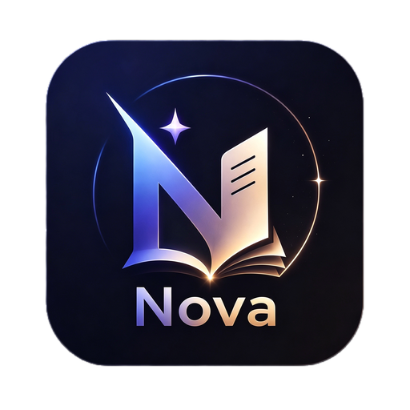

<p align="center">
  
</p>

<h1 align="center">AstroNova</h1>

<p align="center">
  <strong>AI 驱动的天文学全领域科研助手桌面客户端</strong>
  <br>
  从文献检索到论文发表，覆盖天文学科研全流程的一站式 AI 工具集。
</p>

---

## 功能总览

```
                 ┌─ 文献检索 ── 论文精读 ──┐
                 │                         │
  用户提问 ──→   ├─ 科研制图 ── 笔记生成 ──├─→ 论文/PPT 输出
                 │                         │
                 └─ 知识库 RAG ── 写作辅助 ─┘
```

### 📚 文献检索与论文精读

| 功能 | 说明 |
|------|------|
| **ArXiv 搜索** | 按关键词/作者/分类搜索天文学论文，支持 astro-ph.GA、HE、CO、SR 等子领域过滤 |
| **论文全文获取** | 自动从 ArXiv 获取 PDF 并提取文本 |
| **结构化精读** | 输入 arXiv ID，AI 按 7 维度框架分析：研究背景、方法、结果、创新点、局限性、未来工作、个人思考 |
| **批量处理** | 一次分析多篇相关论文，生成对比综述 |

### 📝 NovaForge 笔记生成

| 功能 | 说明 |
|------|------|
| **LaTeX 笔记** | 自动生成含完整导言区的科研笔记 .tex 文件 |
| **Markdown 笔记** | 同时输出 Markdown 版本，方便分享 |
| **自定义章节** | 按需选择背景/方法/结果/讨论等章节结构 |
| **知识沉淀** | 将精读结果转化为可复用的结构化知识 |

### 📈 科研制图

| 功能 | 说明 |
|------|------|
| **7 种图表类型** | 光谱图、光变曲线、SED 能谱分布、彩色图谱、等值线图、统计图、多面板图 |
| **3 种期刊风格** | ApJ (AASTeX)、MNRAS、A&A 标准配色与排版 |
| **AI 代码生成** | 描述你的数据，AI 生成可直接运行的 matplotlib 代码 |
| **矢量输出** | PDF 矢量格式，可直接用于论文投稿 |

### ✍️ 论文写作

| 功能 | 说明 |
|------|------|
| **6 种章节模板** | 摘要、引言、方法、结果、讨论、结论 |
| **3 大期刊标准** | ApJ / MNRAS / A&A 写作规范与风格 |
| **上下文感知** | 基于已有笔记和精读结果生成，保持逻辑连贯 |
| **LaTeX 输出** | 直接生成符合期刊要求的 .tex 代码 |

### 🎬 PPT 生成

| 功能 | 说明 |
|------|------|
| **3 种汇报风格** | 课题汇报 (中文详细)、国际会议 (英文简洁)、答辩开题 (结构完整) |
| **3 种输出格式** | Marp Markdown、Pandoc Markdown、Reveal.js HTML |
| **自动提取内容** | 从论文精读结果自动填充摘要/方法/结果/讨论各页 |
| **一键转换** | Marp 格式可直接用 VS Code 预览并导出 PDF |

### 🧠 知识库 RAG

| 功能 | 说明 |
|------|------|
| **内置知识** | 天文学基础(天体测量/力学/恒星物理)、宇宙学、电磁学、电动力学、观测方法等 11 个模块 |
| **BM25 检索** | 经典全文检索算法，无需 GPU |
| **混合检索** | 支持多知识库 + 来源过滤 |
| **自动扩展** | 可通过插件或手动导入更多文档 |

### 🔌 插件与技能系统

| 功能 | 说明 |
|------|------|
| **插件热加载** | 动态加载/卸载 Python 插件，无需重启 |
| **工具注册** | 插件通过 `@register_tool` 注册为 LLM 可调用的工具 |
| **Skill 注入** | 上传 SKILL.md 自定义 AI 行为与专业知识 |
| **多模型路由** | 不同工具可指定不同 LLM 执行，优化成本与效果 |

---

## 支持的大模型

可同时配置多个 Provider，系统根据任务类型自动路由到最适合的模型：

| 服务商 | 推荐模型 | 适用场景 |
|--------|---------|---------|
| **OpenAI** | GPT-4o、GPT-4o-mini | 文献搜索、论文精读、通用对话 |
| **Anthropic Claude** | Sonnet、Haiku | 笔记生成、论文写作、长文本分析 |
| **DeepSeek** | V3、R1 | 代码生成(制图/分析)、数学推理 |
| **Ollama** | 本地开源模型 | 简单问答、摘要、离线使用 |
| **兼容 API** | SiliconFlow、vLLM 等 | 任意 OpenAI 兼容接口 |

---

## 使用流程

### 第一次使用

```
1. 下载安装包 ──→ 2. 双击安装 ──→ 3. 打开 AstroNova ──→ 4. 设置 → 模型配置 添加 API Key
```

### 典型科研工作流

```
场景：研究"中子星合并"课题

① 对话页 → 搜索 "neutron star mergers gravitational waves"
② 搜索结果中点击感兴趣论文 → 自动精读 (7 维度分析)
③ 精读结果 → 一键生成 NovaForge LaTeX 笔记
④ 从笔记 → 生成科研制图代码 (光谱/光变曲线)
⑤ 论文写作 → 基于笔记和图表撰写引言/方法/结果
⑥ 导出全部 → 生成学术汇报 PPT
```

---

## 安装

### 方式一：下载安装包（推荐）

从 [GitHub Releases](https://github.com/SiriusFzh/astro-nova/releases) 下载 `AstroNova-Setup-1.0.0.exe`

- 双击安装，按提示完成
- 桌面上会出现 AstroNova 快捷方式
- **无需安装 Python**（内置独立后端）

### 方式二：从源码运行

```bash
# 克隆
git clone https://github.com/SiriusFzh/astro-nova.git
cd astro-nova

# Python 依赖
pip install -r requirements.txt

# 前端依赖
cd frontend && npm install && cd ..

# 启动开发模式（后端 + 前端 + Electron）
npm install
npm run dev
```

---

## 技术栈

| 层 | 技术 |
|----|------|
| **后端框架** | Python 3.14 / FastAPI / Uvicorn |
| **数据库** | SQLite + SQLAlchemy (async) |
| **LLM 接入** | OpenAI SDK + Anthropic SDK + 统一 Provider 抽象层 |
| **前端** | Vue 3 (Composition API) + Element Plus + Vite |
| **桌面** | Electron 42 + electron-builder + NSIS |
| **知识库** | BM25 全文检索 (自研) |
| **打包** | PyInstaller (后端独立 EXE) |

---

## 项目结构

```
astro-nova/
├── astro_nova/               # Python 后端
│   ├── main.py               # FastAPI 应用入口
│   ├── providers/             # LLM 供应商抽象层
│   │   ├── base.py            # BaseProvider 抽象类
│   │   ├── openai.py          # OpenAI 兼容 API
│   │   ├── anthropic.py       # Claude API
│   │   ├── deepseek.py        # DeepSeek API
│   │   └── ollama.py          # Ollama 本地模型
│   ├── tools/                 # 科研工具
│   │   ├── arxiv_search.py    # ArXiv 论文搜索
│   │   ├── arxiv_download.py  # PDF 全文下载
│   │   ├── paper_reader.py    # 论文精读
│   │   ├── note_generator.py  # NovaForge 笔记
│   │   ├── figure_generator.py# 科研制图
│   │   ├── writing_assistant.py# 论文写作
│   │   └── ppt_generator.py   # PPT 生成
│   ├── plugins/               # 插件系统
│   ├── skills/                # Skill 系统
│   ├── knowledge/             # 知识库 RAG
│   ├── api/                   # REST API 路由
│   └── database/              # 数据持久化
├── frontend/                  # Vue 3 前端
│   └── src/views/
│       ├── Chat.vue           # AI 对话
│       ├── Search.vue         # 文献搜索
│       ├── Papers.vue         # 论文库
│       ├── Notes.vue          # 笔记管理
│       ├── Figures.vue        # 科研制图
│       ├── Writing.vue        # 论文写作
│       ├── PPT.vue            # PPT 生成
│       └── settings/          # 设置页面
├── electron/                  # Electron 桌面端
│   ├── main.js                # 主进程 + 系统托盘 + 自动更新
│   └── preload.js             # IPC 桥接
├── skills/                    # 预置 SKILL.md
│   ├── astro-search/
│   ├── astro-reader/
│   ├── astro-figure/
│   ├── astro-writing/
│   ├── astro-ppt/
│   ├── astro-digest/
│   └── novaforge/
├── references/                # LaTeX / matplotlib 资源
├── build/                     # 打包配置
└── scripts/                   # 独立 Python 脚本
```

---

## 领域覆盖

AstroNova 面向天文学与天体物理全领域：

| 领域 | ArXiv 分类 | 典型课题 |
|------|-----------|---------|
| 星系天体物理 | astro-ph.GA | 星系演化、恒星形成、AGN、银河系结构 |
| 高能天体物理 | astro-ph.HE | 中子星、黑洞、伽马射线暴、超新星 |
| 宇宙学 | astro-ph.CO | 暗物质、暗能量、CMB、大尺度结构 |
| 太阳与恒星物理 | astro-ph.SR | 恒星演化、星震学、太阳物理 |
| 行星科学 | astro-ph.EP | 系外行星、行星形成、宜居性 |
| 仪器与方法 | astro-ph.IM | 数据处理、望远镜技术、统计方法 |
| 引力波 | gr-qc | 引力波天文学、多信使天文 |
| 空间物理 | physics.space-ph | 太阳风、磁层、空间等离子体 |

---

## 许可证

MIT License © 2026 一叶知秋 (SiriusFzh)
